# ECCV 2026 | RoboStream：让机器人 VLM 记住世界如何被自己改变

> **Paper**: [RoboStream: Weaving Spatio-Temporal Reasoning with Memory in Vision-Language Models for Robotics](https://arxiv.org/abs/2603.12939)  
> **Project**: [robostream123.github.io](https://robostream123.github.io/)  
> **Venue**: ECCV 2026  
> **Code**: Coming soon

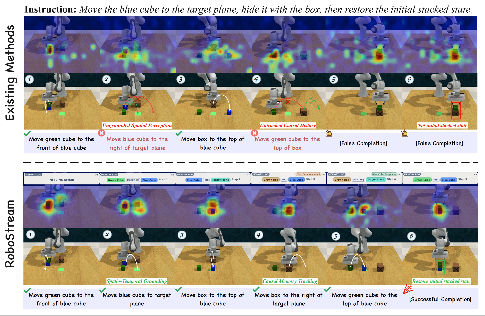

机器人真正难的地方，往往不是看见一个物体，而是在连续操作中记住这个物体经历了什么。

一个积木被移动后，原来的位置不再可靠。一个目标被杯子盖住后，它不可见，但并没有消失。一个塔被拆掉一层后，后续动作不能继续假设支撑关系还在。对人来说，这些状态变化很自然。对当前很多 VLM-based robot planner 来说，每一步却仍像一次新的图像问答。

RoboStream 关注的正是这个断点：**机器人 VLM 不缺一次性看图能力，缺的是持续更新的空间-时间记忆。**

它提出一个 training-free 的长程操作框架，在不微调 VLM 的前提下，把视觉证据、3D 几何和动作历史组织成可追踪、可更新、可推理的状态流。核心思想可以概括为两件事：

- **Spatio-Temporal Fusion Tokens (STF-Tokens)**：把视觉 token 锚定到 3D 几何实体上，让物体跨步骤保持身份和位置连续性；
- **Causal Spatio-Temporal Graph (CSTG)**：记录动作如何改变场景，让规划器能沿着因果历史推理被移动、遮挡或恢复的对象。

这不是给 VLM 再加一点提示词，而是在 VLM 外部补上一个可持续维护的世界状态。

## 真机不是展示，是压力测试

RoboStream 的实验设计里，最值得强调的其实是真实机器人部分。

作者在 Franka Research 3 机械臂上构建了 **21 个真实世界长程任务**，使用前视 Intel RealSense D435i RGB-D 相机和 **17 个彩色实体物体**。这些任务不是普通 pick-and-place，而是围绕两个核心能力设计的压力测试：

- **时空 grounding 与顺序推理**：Block Building 和 Block Disassembly 要求机器人按 Bottom-to-Top 搭建，或按 Top-to-Bottom 拆解，并持续维护支撑关系；
- **因果记忆与物体恒常性**：Block Hide and Restore 要求机器人在目标完全遮挡后，仍能记住其身份、最后位置和原始结构，并恢复场景。

每个任务配置执行 3 次。Hard 难度最高扩展到 **7 个物体、6-7 个连续步骤**，一旦拆错支撑块或忘记被遮挡物体，任务会直接失败。

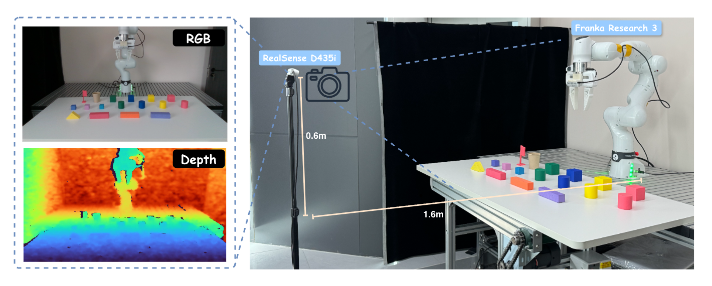

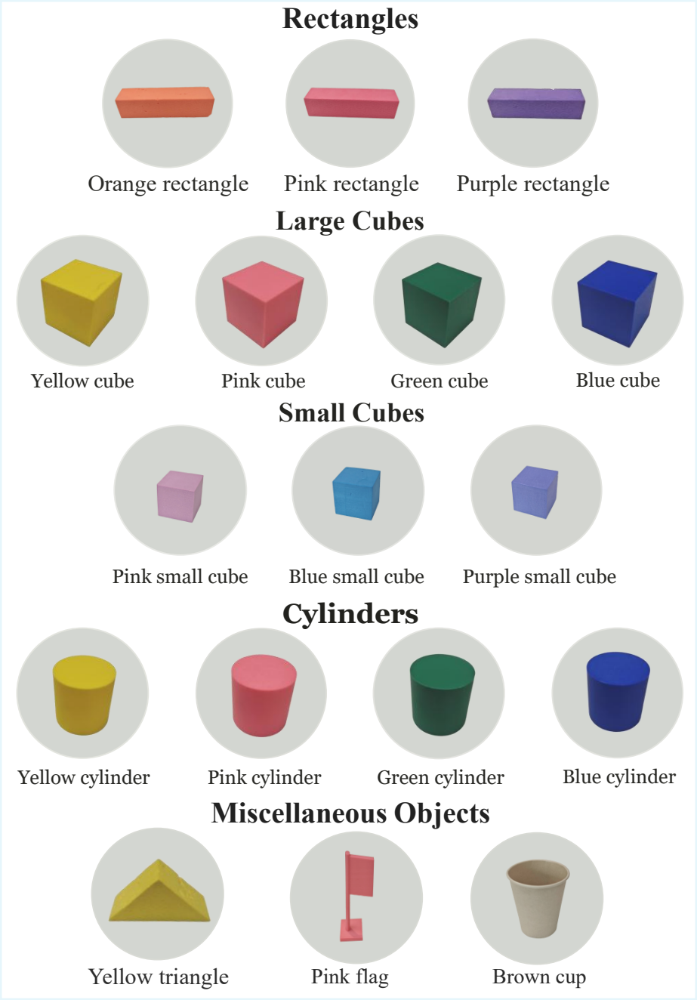

这个设置很关键：它把“长程记忆”从一个抽象概念，变成了真实机械臂必须面对的物理问题。机器人要处理遮挡、接触误差、几何支撑、颜色相近干扰物，以及动作造成的不可逆状态变化。

## 从当前帧问答，到持续状态流

当前很多 VLM-based planner 的工作方式可以简化为：

1. 观察当前图像；
2. 让 VLM 判断下一步动作；
3. 执行动作后，用新图像重新推理。

这个范式在短任务里很自然，但在长程操作中会暴露三个问题：

- **物体恒常性断裂**：目标一旦被遮挡、移动或离开视野，就可能被模型“忘掉”；
- **空间关系无法继承**：上一轮建立的支撑、堆叠、容器关系，不能稳定传到下一步；
- **错误持续放大**：早期一个小的空间误判，会在后续抓取、放置、遮挡和恢复中变成连锁失败。

RoboStream 的核心判断是：长程机器人操作不是“每一步看得更准”就够了，而是要让系统知道**之前发生过什么，以及这些动作把世界改成了什么样**。

## STF-Tokens：把图像区域变成可追踪的 3D 实体

普通视觉 token 往往描述的是当前帧里的局部图像区域。但机器人操作里的物体不是静态像素块，而是会被抓取、移动、堆叠、遮挡、放入容器、再重新出现的三维实体。

STF-Tokens 将视觉证据与显式 3D 几何属性绑定起来，包括对象中心、形状和空间位置。这样一来，VLM 不需要在每一步都从像素重新猜测场景结构，而是可以引用被几何锚定的对象实例。

这让“红色积木在哪里”“它是否还在蓝色积木上”“刚才那个被遮住的目标是否仍然存在”变成可维护的状态，而不是每一步都重新生成的猜测。

## CSTG：记录动作如何改变世界

只追踪对象还不够。长程操作更难的部分，是动作会不断改变场景。

Causal Spatio-Temporal Graph (CSTG) 将对象、空间关系和动作结果组织成因果图。每次动作之后，系统不仅更新当前视觉观测，也记录动作触发的状态变化，例如物体被移动、结构被拆解、目标被遮挡或恢复。

这使后续规划不再只依赖当前画面，而是可以回到因果历史里寻找依据。对于 Hide-and-Restore 这类任务尤其重要，因为被遮挡物体的直接视觉证据已经消失，模型只能依赖记忆恢复隐藏状态。

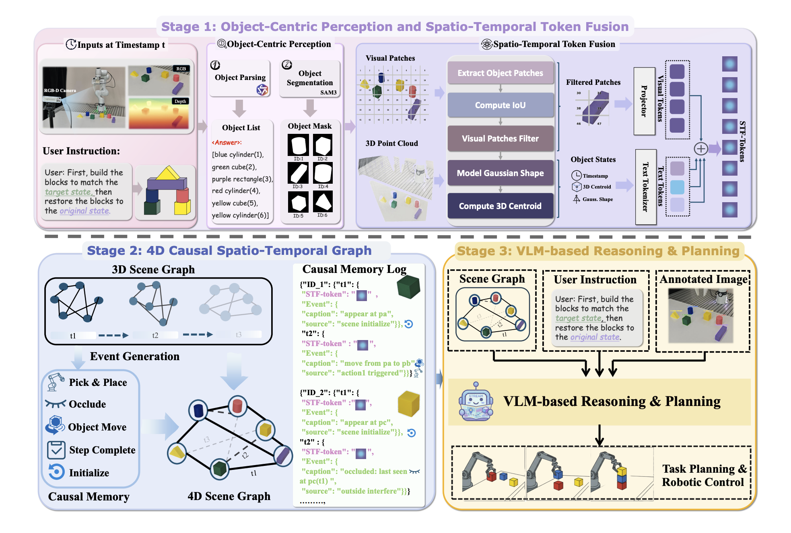

## 真实世界结果：记忆越关键，差距越明显

在真实世界实验中，RoboStream 在 Hard 级别 Block Building 上达到 **44.4%** 成功率，在 Hard 级别 Block Disassembly 上达到 **66.7%**。相比之下，SoFar 和 VoxPoser 在这些设置中难以超过 **11.1%**。

更有说服力的是 Hide-and-Restore。该任务要求机器人在目标被完全遮挡后，执行中间干扰步骤，再取回隐藏物体并恢复原始结构。RoboStream-235B 达到 **88.9%**，RoboStream-8B 也保持 **33.3%**，而 SoFar 和 VoxPoser 均为 **0%**。

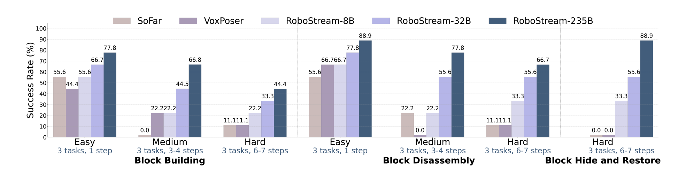

这里的差距不是普通识别精度带来的，而是由任务本身决定的：当目标不可见、支撑关系改变、历史状态必须被调用时，反应式视觉规划器会失去依据，而显式时空记忆开始成为核心能力。

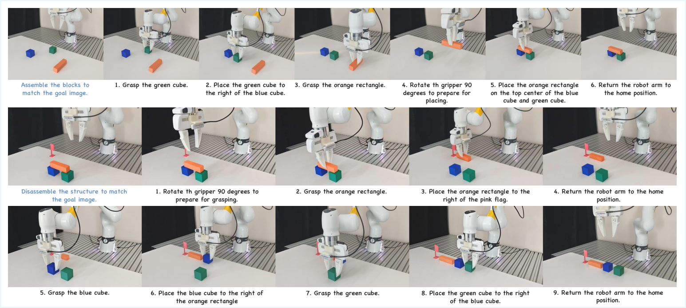

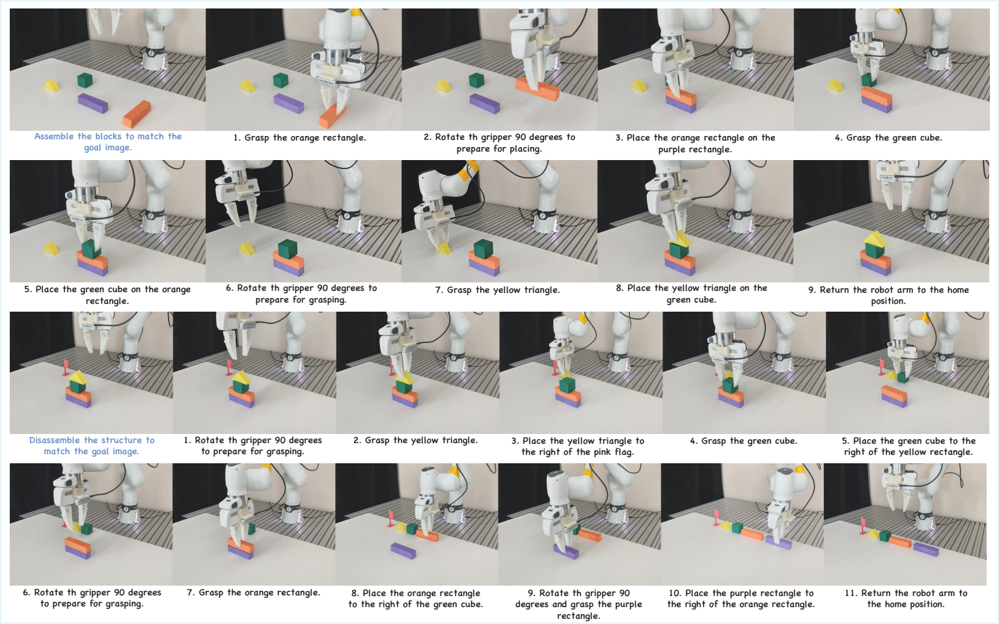

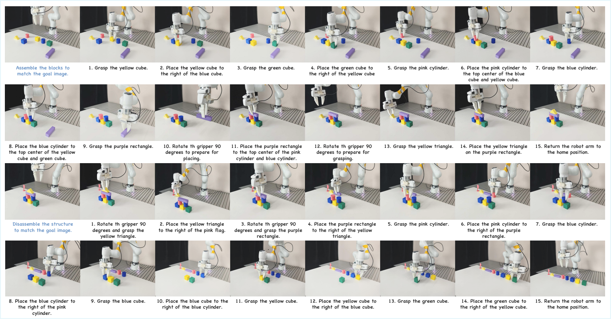

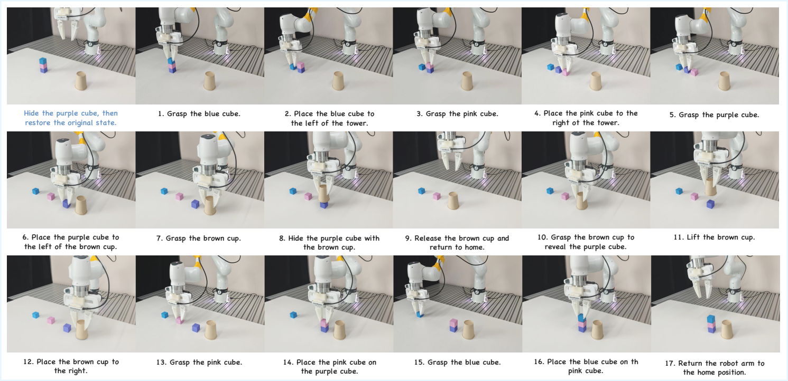

## 模拟长程任务：不是只靠更大的 VLM

在 RLBench 长程任务上，RoboStream-235B 达到 **90.5%** 平均成功率，明显高于 SoFar 的 **28.0%** 和 VoxPoser 的 **26.5%**。即使是 RoboStream-8B，也达到 **58.0%**，说明提升并不只是来自模型规模。

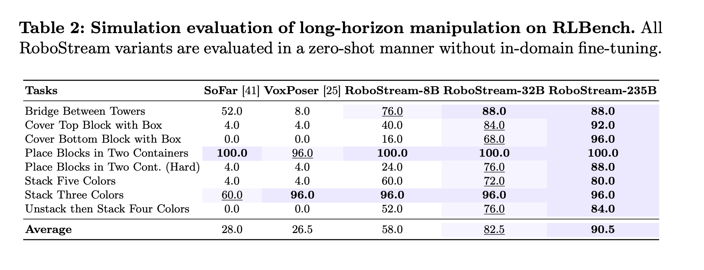

消融实验进一步说明了这一点。去掉 CSTG 后，平均成功率从 **90.5%** 降到 **14.5%**；去掉 STF-Tokens 后，降到 **79.5%**；两者都去掉时，仅为 **12.0%**。

这组结果很直接：CSTG 负责长程逻辑和因果连续性，STF-Tokens 负责物理执行中的几何精度。两者配合，才让 VLM 能从“当前帧反应”转向“跨步骤推理”。

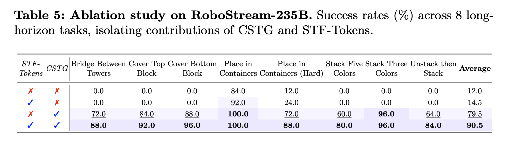

## 泛化与空间推理：从机器人动作到 6-DoF 理解

RoboStream 还在 SIMPLER、6-DoF SpatialBench 和 Open6DOR V2 上进行评估，覆盖跨 embodiment 零样本泛化、空间 VQA 和 6-DoF object rearrangement。

这些结果补充证明了 STF-Tokens 的价值：它不只是帮助长程任务记忆历史，也让 VLM 在位置、方向和物体关系上获得更稳定的几何参照。

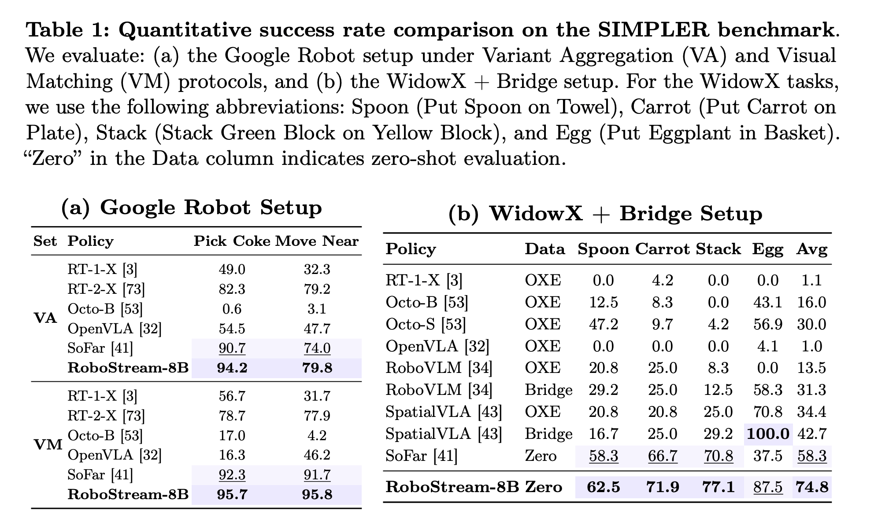

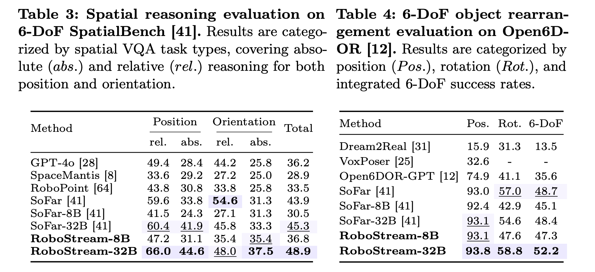

## 定性对比：失败往往发生在“忘记之前”

从定性结果看，SoFar 和 VoxPoser 的错误通常不是单纯“没看到”，而是没有持续跟踪对象身份、空间关系和动作后果。RoboStream 则通过 STF-Tokens 和 CSTG，将对象 grounding 与因果记忆同时保留下来。

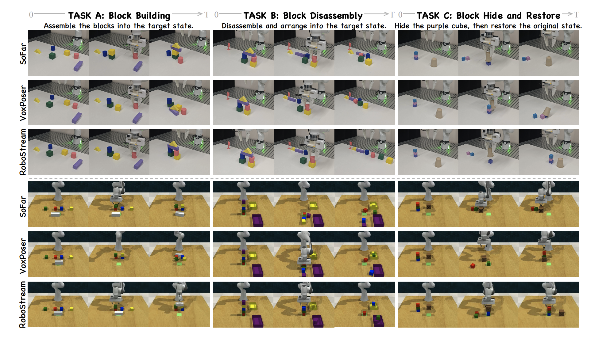

这也是 RoboStream 的关键定位：它不是把 VLM 做成一个更强的单帧图像问答器，而是让 VLM 在机器人执行过程中拥有一个可更新的、结构化的世界模型。

## 为什么这件事重要

机器人走向开放环境后，挑战不会只来自视觉识别，也不会只来自语言理解。更根本的问题是：系统能否在连续交互中维护一个稳定、可更新、可追溯的世界状态。

RoboStream 给出的答案是，长程机器人操作需要把三件事绑在一起：视觉证据、3D 几何和动作历史。

如果说过去的 VLM robot planner 更像是在每一步重新看图做题，那么 RoboStream 更像是在让机器人带着记忆行动。它知道物体在哪里，也知道世界是怎样一步步变成现在这样的。

这正是 VLM 进入长程真实操作时最缺的一环：**persistent spatio-temporal memory for an evolving physical world**。

## Citation

```bibtex
@misc{huang2026robostreamweavingspatiotemporalreasoning,
  title={RoboStream: Weaving Spatio-Temporal Reasoning with Memory in Vision-Language Models for Robotics},
  author={Yuzhi Huang and Jie Wu and Weijue Bu and Ziyi Xiong and Gaoyang Jiang and Ye Li and Kangye Ji and Shuzhao Xie and Yue Huang and Chenglei Wu and Jingyan Jiang and Zhi Wang},
  year={2026},
  eprint={2603.12939},
  archivePrefix={arXiv},
  primaryClass={cs.RO},
  url={https://arxiv.org/abs/2603.12939}
}
```
